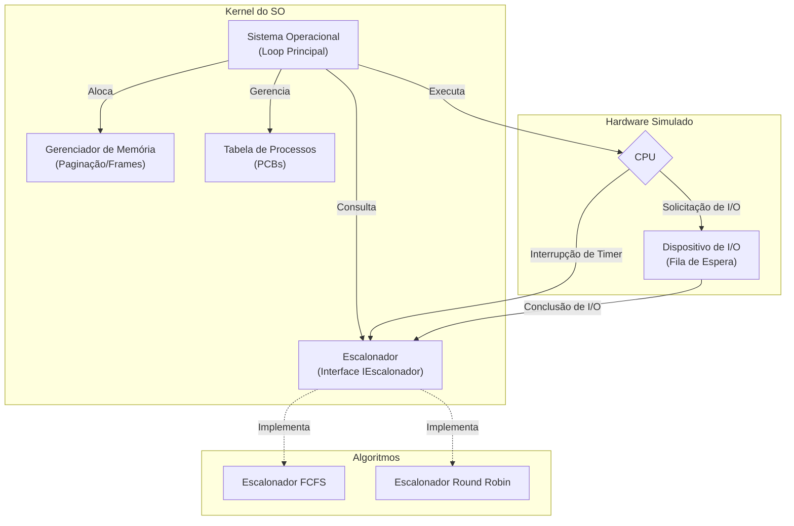

Simulador de Sistema Operacional
Alunos: João Victor Camargo (RA: 113803) e Guilherme Belem (RA: 114031)

Este projeto consiste em um simulador simplificado de Sistema Operacional desenvolvido em C#, com fins exclusivamente didáticos. O objetivo central é reproduzir de forma acessível os conceitos fundamentais de Sistemas Operacionais, tais como a criação e gerenciamento de processos, o funcionamento de diferentes algoritmos de escalonamento, a alocação de memória, a execução de operações de entrada e saída, além da coleta de métricas e a simulação do avanço do tempo no sistema.

Cada processo do simulador é representado por um bloco de controle de processo (PCB) contendo identificador, nome, tempo de CPU restante, estado atual, prioridade, contador de programa, registradores simulados e uma tabela de arquivos abertos. Também são registradas informações individuais, como o tempo total de espera, o momento em que iniciou a execução e o instante em que foi finalizado. Para threads, o sistema conta com uma estrutura simples de TCB associada a cada processo, funcionando apenas como representação lógica. Todos os processos criados ficam armazenados em uma tabela que permite buscas otimizadas por ID.

O sistema possui dois algoritmos de escalonamento implementados através de uma interface IEscalonador, garantindo a aplicação dos princípios SOLID. O primeiro é o FCFS (First Come First Served), que atende processos estritamente na ordem de chegada. O segundo é o Round Robin, que foi otimizado nesta versão para utilizar uma estrutura de dados baseada em filas (Queue), garantindo complexidade O(1) na seleção de processos e distribuindo a CPU de forma circular com quantum configurável. O gerenciamento de memória é feito através de molduras (frames), onde cada processo tenta ocupar uma moldura no momento da criação. A implementação atual inclui verificações de segurança (bounds checking) para garantir a integridade da memória e evitar acessos inválidos, emitindo avisos de memória insuficiente quando necessário.

Para a simulação de entrada e saída, há um dispositivo simples que mantém uma fila de espera independente da CPU. O subsistema de logs foi modernizado para utilizar uma arquitetura orientada a eventos (Observer Pattern). Isso desacopla a lógica do núcleo do sistema da interface de saída; o Logger dispara eventos contendo o timestamp [t=...] e a mensagem, permitindo que a aplicação principal (Program.cs) decida como exibir ou armazenar esses dados. São coletadas métricas globais como número de trocas de contexto e utilização da CPU, além de métricas individuais de cada processo.

O código foi organizado em diferentes arquivos para facilitar a manutenção e a legibilidade: Program.cs contém a configuração inicial e a subscrição dos eventos de log; SistemaOperacional.cs atua como o kernel, coordenando o loop de execução; Processo.cs define o PCB; EscalonadorRR.cs e EscalonadorFCFS.cs implementam as políticas de escalonamento; GerenciadorMemoria.cs controla a alocação física de quadros de forma segura; e Logger.cs gerencia a emissão de eventos de monitoramento.


*********************************************************************************************************************************************************************************************************************

```mermaid
stateDiagram-v2
    [*] --> Novo: Criação
    Novo --> Pronto: Admissão (Memória OK)
    Pronto --> Executando: Dispatcher
    Executando --> Pronto: Interrupção (Quantum)
    Executando --> Terminado: Fim da Execução
    Terminado --> [*]: Desalocação
