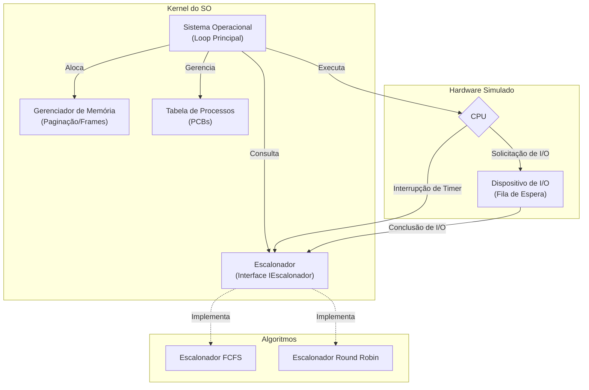

*********************************************************************************************************************************************************************************************************************

stateDiagram-v2
    [*] --> Novo: Criação
    Novo --> Pronto: Admissão (Memória OK)
    Pronto --> Executando: Dispatcher
    Executando --> Pronto: Interrupção (Quantum)
    Executando --> Terminado: Fim da Execução
    Terminado --> [*]: Desalocação
